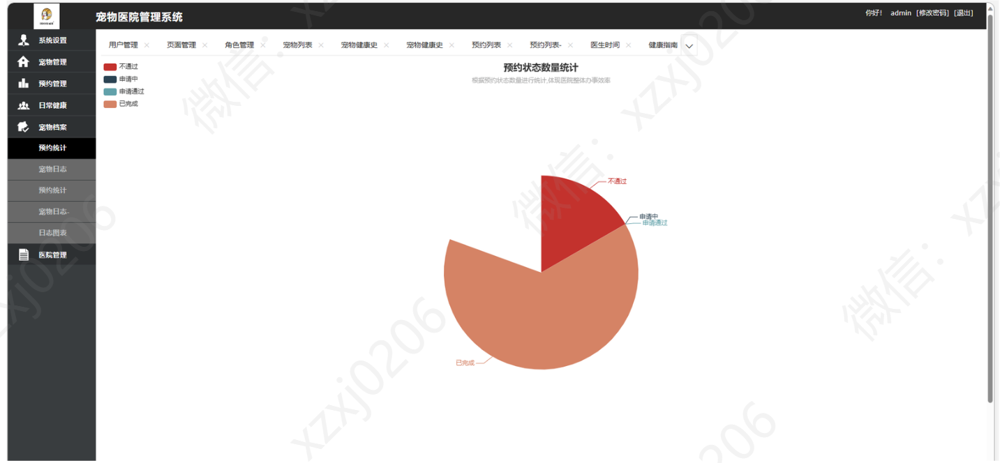
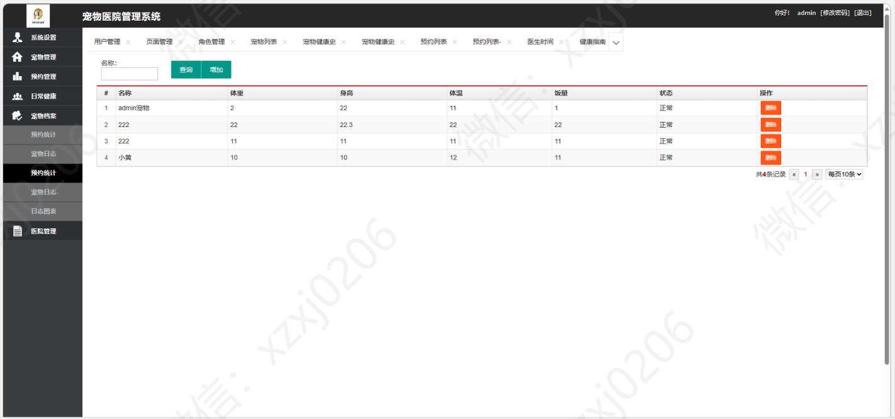
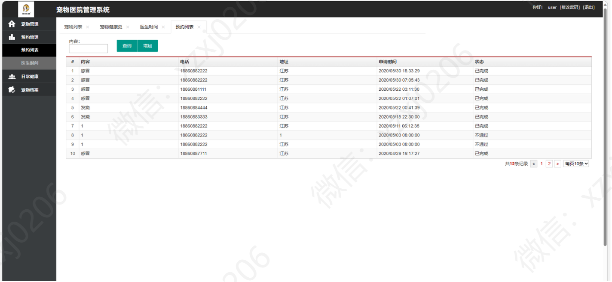

# 宠物医院管理系统

### 9.9￥ 获取完整源码+sql，附赠12000字论文参考，需要加Q：3577148218 ,备用Q: 3808981644
### 有问题，或者需要协助调试运行项目的也可联系
### 获取更多项目，关注公众号：编程项目集

## 一、项目介绍

数据库：MySQL

前端：H5，js，layui等

后端：springboot，SpringMVC，MyBatis

系统总体分为3个角色：分别是系统管理员；医生和用户；不能的角色拥有不同的功能权限，下面详细介绍：

系统管理员:
系统设置
宠物管理
预约管理
日常健康
宠物档案管理
医院管理（预约统计，发布指南等等…）

医生：
宠物管理（宠物健康史 …）
预约管理（预约管理，医生时间管理…）
宠物档案管理（宠物日志…）
医院管理（预约统计，发布指南等等…）

用户：
宠物管理（个人宠物列表，宠物健康史…）
预约管理（预约管理，医生时间管理…）
日常健康（健康指南，健康监测，健康标准…）
宠物档案管理（预约统计，宠物日志，日志图片分析…）

## 二、项目运行界面

## 三、12000字项目文档

## 四、系统运行界面截图

### 1、管理员模块部分功能截图

### 2、医生模块部分功能截图

### 3、用户模块部分功能截图

### 9.9￥ 获取完整源码+sql，需要加Q：3577148218 ,备用Q: 3808981644
### 有问题，或者需要协助调试运行项目的也可联系

